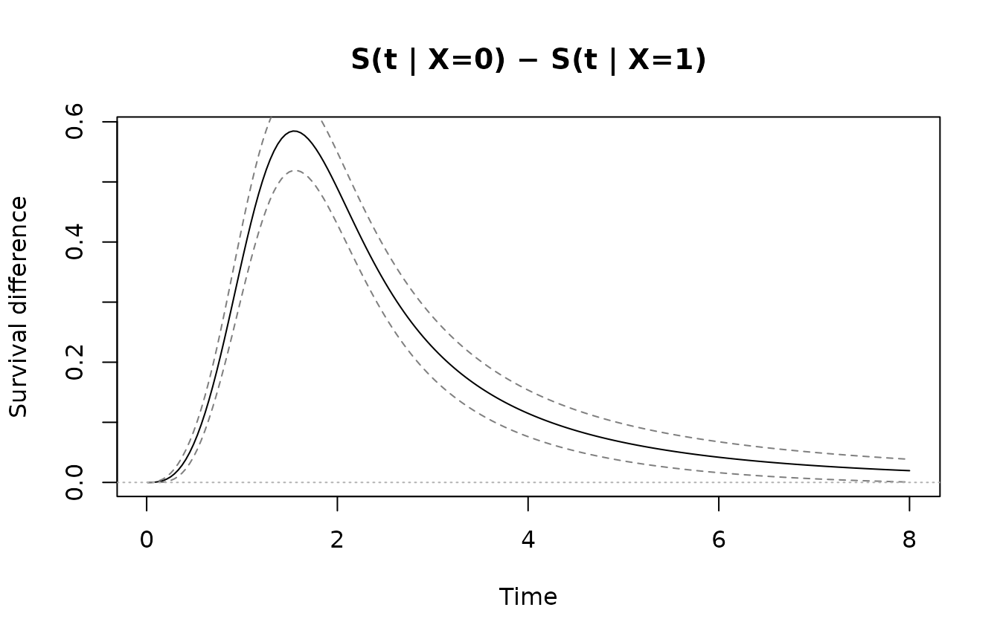
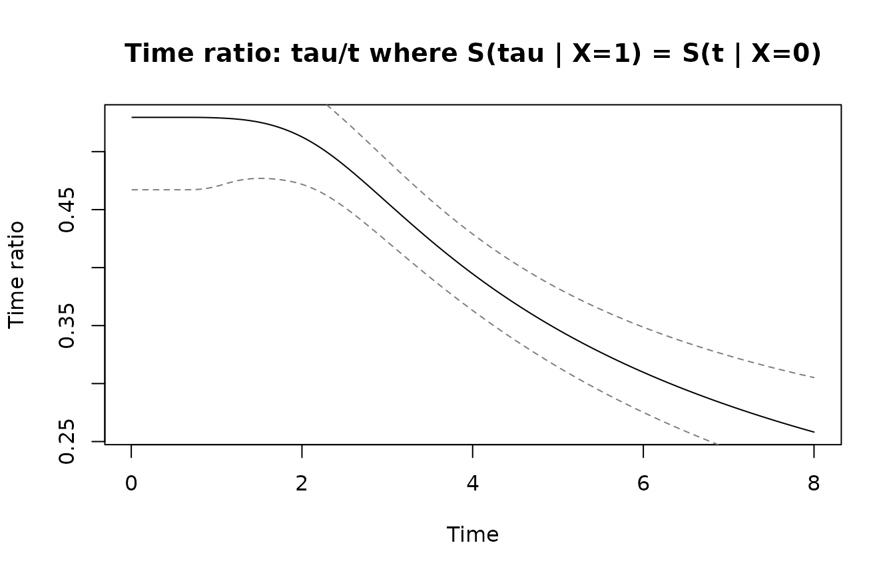
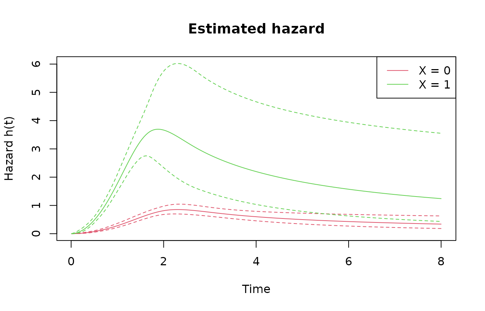
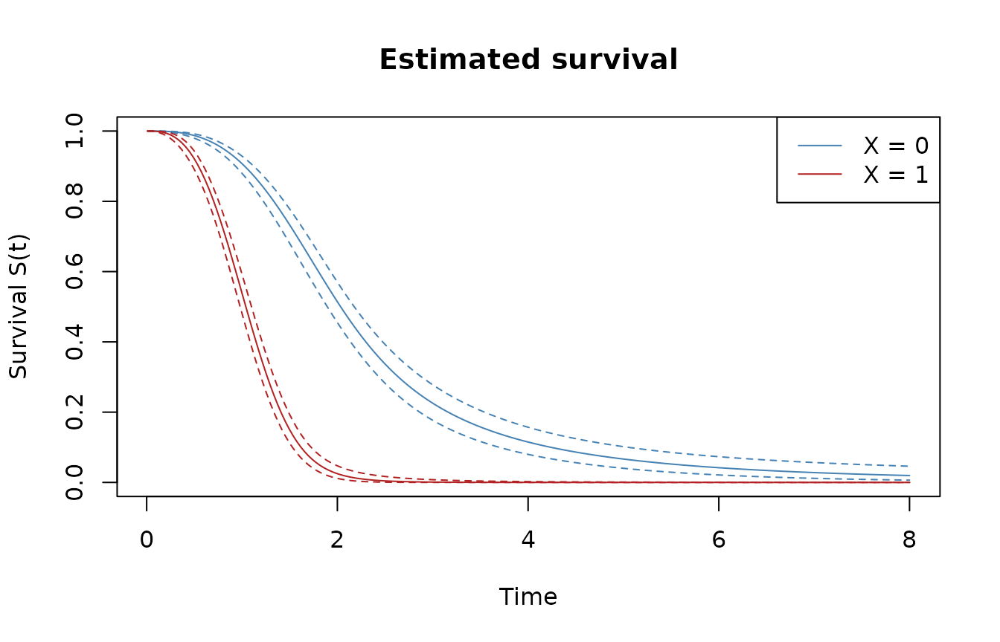
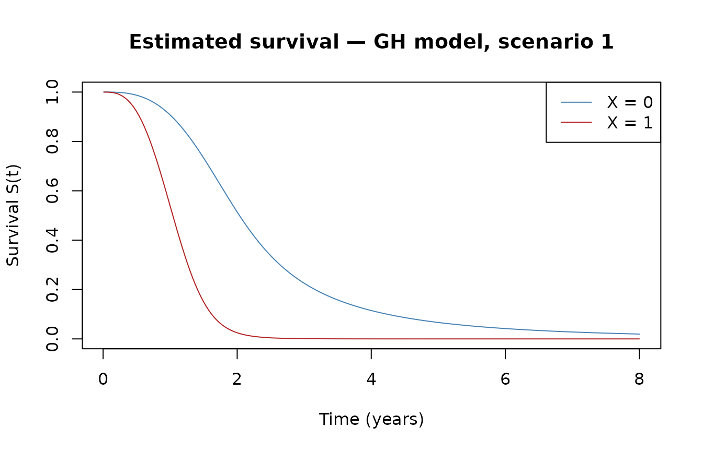
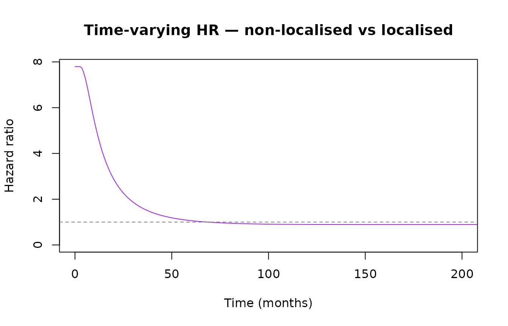

# Getting started with genhaz

## Introduction

In survival analysis, covariate effects are typically modelled through
one of two mechanisms: a multiplicative effect on the hazard
(proportional hazards, PH) or a multiplicative effect on time
(accelerated failure time, AFT). **Generalized hazard (GH) models**
combine both simultaneously:

``` math
h(t \mid x) = h_0\!\left(t\,e^{\beta_1^\top x}\right) \cdot e^{(\beta_1+\beta_2)^\top x}
```

This nests PH ($`\beta_1 = 0`$), AFT ($`\beta_2 = 0`$), and additive
hazards (AH, $`\beta_1 = -\beta_2`$) as special cases. A key advantage:
combining the time-acceleration parameter $`\beta_1`$ and the
hazard-scaling parameter $`\beta_2`$ can capture time-varying hazard
ratios with only two parameters per covariate.

`genhaz` fits penalised cubic restricted spline GH models on the
log-time scale, with the smoothing parameter selected automatically by
minimising a modified likelihood cross-validation (LCV) criterion.

## Model types

The `model_type` argument selects the sub-model per covariate:

| `model_type` | Constraint             | Interpretation           |
|--------------|------------------------|--------------------------|
| `"GH"`       | none                   | Full generalised hazard  |
| `"PH"`       | $`\beta_1 = 0`$        | Proportional hazards     |
| `"AFT"`      | $`\beta_2 = 0`$        | Accelerated failure time |
| `"AH"`       | $`\beta_1 = -\beta_2`$ | Additive hazards         |

Mixed models are supported via a vector,
e.g. `model_type = c("PH", "GH")` for two covariates.

## Censoring types

| `Surv` call | Censoring | Internal type |
|----|----|----|
| `Surv(time, event)` | Right-censoring | `"rc"` |
| `Surv(start, stop, event)` | Left-truncation + right-censoring | `"lt_rc"` |
| `Surv(t1, t2, type="interval2")` | Interval censoring | `"ic"` |

------------------------------------------------------------------------

## Quick start

We simulate 500 observations from scenario 1 (bathtub-shaped baseline
hazard) with $`\beta_1 = \beta_2 = 0.5`$ and fit a GH model with
automatic smoothing parameter selection.

``` r

library(genhaz)
library(survival)

set.seed(42)
dat <- sim_scenario(scenario = 1, beta1 = 0.5, beta2 = 0.5, n = 500)
head(dat)
#>        time X event    T_true
#> 1 1.5137723 1     1 1.5137723
#> 2 0.6274633 1     0 1.4308403
#> 3 1.9735251 0     1 1.9735251
#> 4 0.6619293 1     1 0.6619293
#> 5 1.5659811 1     1 1.5659811
#> 6 0.2222732 1     0 0.5267612
```

``` r

fit <- fit_genhaz(
  surv       = Surv(dat$time, dat$event),
  formula    = ~ X,
  data       = dat,
  model_type = "GH",
  profile    = TRUE,
  n_knots    = 6,
  tol_LCV    = 0.05,
  lcv_method = "optimize"
)
```

------------------------------------------------------------------------

## Inspecting the fit

[`print()`](https://rdrr.io/r/base/print.html) gives a concise overview:
model metadata and a coefficient table with Wald confidence intervals.

``` r

print(fit)
#> Fitted generalized hazard model (genhaz)
#> 
#>   Model type : GH
#>   Knots      : 6 (log-time scale)
#>   Lambda     : 362.7
#>   EDF        : 5.89
#>   AIC        : 877.97
#> 
#> Covariate coefficients (Wald 95% CI):
#>         Estimate Std.Err      z  p.value lower.95% upper.95%
#> beta1_X   0.2033  0.1521 1.3364 0.181419   -0.0949    0.5015
#> beta2_X   1.2617  0.3713 3.3983 0.000678    0.5340    1.9894
```

[`summary()`](https://rdrr.io/r/base/summary.html) adds the stored
formula, exponentiated estimates, and a full CI table. `exp(beta1)` is
the time-acceleration factor; `exp(beta2)` is the hazard-scaling factor.

``` r

summary(fit)
#> Fitted generalized hazard model (genhaz)
#> 
#>   Formula    : ~X
#>   Model type : GH
#>   Knots      : 6 (log-time scale)
#>   Lambda     : 362.7
#>   EDF        : 5.89
#>   AIC        : 877.97
#> 
#> Covariate coefficients (Wald 95% CI):
#>         Estimate Std.Err     z  p.value    lower  upper exp(Est.) exp(lower)
#> beta1_X   0.2033  0.1521 1.336 0.181419 -0.09487 0.5015     1.225     0.9095
#> beta2_X   1.2617  0.3713 3.398 0.000678  0.53401 1.9894     3.531     1.7058
#>         exp(upper)
#> beta1_X      1.651
#> beta2_X      7.311
```

The summary object can also be used programmatically:

``` r

s <- summary(fit)
s$coef_tab
#>          Estimate   Std.Err        z      p.value       lower     upper
#> beta1_X 0.2033293 0.1521473 1.336398 0.1814192329 -0.09487388 0.5015326
#> beta2_X 1.2617161 0.3712835 3.398255 0.0006781715  0.53401378 1.9894184
#>          exp.Est exp.lower exp.upper
#> beta1_X 1.225476 0.9094876   1.65125
#> beta2_X 3.531477 1.7057652   7.31128
```

------------------------------------------------------------------------

## Predictions

[`predict()`](https://rdrr.io/r/stats/predict.html) accepts a
`data.frame` of covariate values (one row per group) and a time grid,
and returns a long `data.frame` with pointwise delta-method confidence
intervals. Row names of `newdata` become the group labels.

``` r

t_grid <- seq(0.01, 8, length.out = 200)

nd <- data.frame(X = c(0, 1))
rownames(nd) <- c("X = 0", "X = 1")

pred_h <- predict(fit, newdata = nd, times = t_grid, type = "hazard")
head(pred_h)
#>   pattern       time     estimate        lower        upper
#> 1   X = 0 0.01000000 4.160143e-05 4.277277e-06 0.0004046216
#> 2   X = 0 0.05015075 9.164835e-04 2.184886e-04 0.0038443294
#> 3   X = 0 0.09030151 2.831218e-03 9.135786e-04 0.0087740606
#> 4   X = 0 0.13045226 5.732711e-03 2.229556e-03 0.0147401406
#> 5   X = 0 0.17060302 9.590806e-03 4.264609e-03 0.0215690443
#> 6   X = 0 0.21075377 1.438436e-02 7.092434e-03 0.0291733137
```

Survival and cumulative hazard are requested via `type`:

``` r

pred_s <- predict(fit, newdata = nd, times = t_grid, type = "survival")
head(pred_s)
#>   pattern       time  estimate     lower     upper
#> 1   X = 0 0.01000000 0.9999999 0.9999983 1.0000000
#> 2   X = 0 0.05015075 0.9999842 0.9999211 0.9999969
#> 3   X = 0 0.09030151 0.9999124 0.9996763 0.9999763
#> 4   X = 0 0.13045226 0.9997437 0.9992162 0.9999162
#> 5   X = 0 0.17060302 0.9994394 0.9985041 0.9997900
#> 6   X = 0 0.21075377 0.9989616 0.9975089 0.9995673
```

### Restricted mean survival time

`type = "rmst"` integrates the survival curve from 0 to each restriction
time $`\tau`$ using 25-point Gauss-Legendre quadrature. Confidence
intervals are obtained via the delta method applied to the integral.

``` r

tau_grid <- c(2, 4, 6, 8)
rmst <- predict(fit, newdata = nd, times = tau_grid, type = "rmst")
rmst
#>   pattern time estimate    lower    upper
#> 1   X = 0    2 1.700890 1.650400 1.751381
#> 2   X = 0    4 2.210935 2.079668 2.342201
#> 3   X = 0    6 2.351705 2.174575 2.528835
#> 4   X = 0    8 2.409497 2.202627 2.616366
#> 5   X = 1    2 1.062684 1.008257 1.117112
#> 6   X = 1    4 1.069942 1.012366 1.127517
#> 7   X = 1    6 1.069981 1.012366 1.127596
#> 8   X = 1    8 1.069981 1.012363 1.127599
```

### Between-group differences

`type = "surv_diff"` and `type = "rmst_diff"` compare two covariate
patterns (exactly two rows in `newdata`). The gradient of the difference
is propagated through the shared parameter covariance matrix, so the
estimator accounts for the correlation between the two curves.

``` r

diff_s <- predict(fit, newdata = nd, times = t_grid, type = "surv_diff")
head(diff_s)
#>         pattern       time     estimate         lower        upper
#> 1 X = 0 - X = 1 0.01000000 7.687261e-07 -1.020718e-06 2.558170e-06
#> 2 X = 0 - X = 1 0.05015075 8.492595e-05 -4.097166e-05 2.108236e-04
#> 3 X = 0 - X = 1 0.09030151 4.722709e-04 -8.320470e-05 1.027747e-03
#> 4 X = 0 - X = 1 0.13045226 1.380587e-03  1.967618e-05 2.741499e-03
#> 5 X = 0 - X = 1 0.17060302 3.017210e-03  4.595873e-04 5.574832e-03
#> 6 X = 0 - X = 1 0.21075377 5.580363e-03  1.452698e-03 9.708027e-03

plot(diff_s$time, diff_s$estimate, type = "l",
     xlab = "Time", ylab = "Survival difference",
     main = "S(t | X=0) − S(t | X=1)")
lines(diff_s$time, diff_s$lower, lty = 2, col = "grey50")
lines(diff_s$time, diff_s$upper, lty = 2, col = "grey50")
abline(h = 0, lty = 3, col = "grey70")
```



The RMST difference summarises the group contrast in a single number per
restriction time:

``` r

rmst_diff <- predict(fit, newdata = nd, times = tau_grid, type = "rmst_diff")
rmst_diff
#>         pattern time  estimate     lower     upper
#> 1 X = 0 - X = 1    2 0.6382059 0.5651391 0.7112726
#> 2 X = 0 - X = 1    4 1.1409929 0.9980127 1.2839732
#> 3 X = 0 - X = 1    6 1.2817235 1.0957373 1.4677097
#> 4 X = 0 - X = 1    8 1.3395153 1.1250637 1.5539669
```

`type = "hazard_ratio"` gives h1(t)/h2(t) — time-varying since the model
is GH (it would be constant under PH). The CI is on the log scale.

``` r

hr <- predict(fit, newdata = nd, times = t_grid, type = "hazard_ratio")
plot(hr$time, hr$estimate, type = "l",
     xlab = "Time", ylab = "Hazard ratio",
     main = "h(t | X=0) / h(t | X=1)")
lines(hr$time, hr$lower, lty = 2, col = "grey50")
lines(hr$time, hr$upper, lty = 2, col = "grey50")
abline(h = 1, lty = 3, col = "grey70")
```


`type = "time_ratio"` gives TR(t) = tau/t where S2(tau) = S1(t): for
each time t, how many multiples of t does group 2 need to reach the same
survival level. Computed via `uniroot` per time point with a
delta-method CI.

``` r

tr <- predict(fit, newdata = nd, times = t_grid, type = "time_ratio")
plot(tr$time, tr$estimate, type = "l",
     xlab = "Time", ylab = "Time ratio",
     main = "Time ratio: tau/t where S(tau | X=1) = S(t | X=0)")
lines(tr$time, tr$lower, lty = 2, col = "grey50")
lines(tr$time, tr$upper, lty = 2, col = "grey50")
abline(h = 1, lty = 3, col = "grey70")
```



------------------------------------------------------------------------

## Plotting

[`plot()`](https://rdrr.io/r/graphics/plot.default.html) draws all
groups as coloured lines with dashed confidence bands. Row names of
`newdata` appear in the legend.

``` r

plot(fit, newdata = nd, times = t_grid)
```



``` r

plot(fit, newdata = nd, times = t_grid, type = "survival",
     col = c("steelblue", "firebrick"))
```



Pass additional graphical parameters directly through `...`:

``` r

plot(fit, newdata = nd, times = t_grid, type = "survival",
     col  = c("steelblue", "firebrick"),
     main = "Estimated survival — GH model, scenario 1",
     xlab = "Time (years)",
     ci   = FALSE)
```



------------------------------------------------------------------------

## Inference

### Wald confidence intervals

[`waldCI()`](https://aaronjehle.github.io/genhaz/reference/waldCI.md)
computes a Wald CI for a single parameter;
[`waldCI_minus()`](https://aaronjehle.github.io/genhaz/reference/waldCI_minus.md)
provides a CI for the difference $`\beta_1 - \beta_2`$ (accounting for
their covariance via the delta method).

``` r

waldCI(fit, "beta1_X")
#>       lower       upper 
#> -0.09487388  0.50153255
waldCI(fit, "beta2_X")
#>     lower     upper 
#> 0.5340138 1.9894184
waldCI_minus(fit, "beta1_X", "beta2_X")
#>       lower       upper 
#> -2.07437271 -0.04240081
```

### Likelihood ratio test

Fit a restricted (PH) model and test against the full GH model:

``` r

fit_ph <- fit_genhaz(
  surv       = Surv(dat$time, dat$event),
  formula    = ~ X,
  data       = dat,
  model_type = "PH",
  profile    = TRUE,
  n_knots    = 6,
  tol_LCV    = 0.05,
  lcv_method = "optimize"
)

LR(fit_ph, fit)
#> LR-statistic      p_value 
#>   5.68044586   0.01715501
```

------------------------------------------------------------------------

## Real-data example: melanoma survival

We use the
[`biostat3::melanoma`](https://rdrr.io/pkg/biostat3/man/melanoma.html)
dataset: 7,775 patients with melanoma cancer, including age group,
period of diagnosis, sex, cancer stage, survival time in months, and a
death indicator. The question of interest is the effect of non-localised
stage on survival, adjusted for age, period, and sex.

### Data preparation

``` r

library(biostat3)

mel        <- biostat3::melanoma
mel$X      <- ifelse(mel$stage == "Localised", 0, 1)
mel$event  <- ifelse(mel$status == "Dead: cancer", 1, 0)
mel$time   <- mel$surv_mm
mel$period <- ifelse(mel$year8594 == "Diagnosed 75-84", 0, 1)
```

### Fitting the model

The full model fit takes approximately ~9 min and is not re-run here.
The code below shows exactly what was run to produce the stored result:

``` r

fit_melanoma <- fit_genhaz(
  Surv(mel$time, mel$event), ~ X + period + agegrp + sex,
  data       = mel,
  model_type = "GH",
  profile    = TRUE,
  n_knots    = 8,
  tol_LCV    = 0.001,
  lcv_method = "optimize"
)
```

``` r

data("fit_melanoma")
```

### Results

``` r

print(fit_melanoma)
#> Fitted generalized hazard model (genhaz)
#> 
#>   Model type : GH
#>   Knots      : 8 (log-time scale)
#>   Lambda     : 5970
#>   EDF        : 15.80
#>   AIC        : 24261.08
#> 
#> Covariate coefficients (Wald 95% CI):
#>                   Estimate Std.Err       z  p.value lower.95% upper.95%
#> beta1_X             1.1428  0.0857 13.3398  < 2e-16    0.9749    1.3107
#> beta1_period       -0.0711  0.0763 -0.9317  0.35150   -0.2208    0.0785
#> beta1_agegrp45-59   0.0764  0.1020  0.7492  0.45371   -0.1235    0.2764
#> beta1_agegrp60-74   0.1117  0.1002  1.1146  0.26504   -0.0847    0.3081
#> beta1_agegrp75+     0.2973  0.1190  2.4982  0.01248    0.0641    0.5306
#> beta1_sexFemale    -0.1150  0.0738 -1.5576  0.11933   -0.2597    0.0297
#> beta2_X             0.3055  0.0695  4.3925 1.12e-05    0.1692    0.4418
#> beta2_period       -0.3054  0.0655 -4.6637 3.11e-06   -0.4338   -0.1771
#> beta2_agegrp45-59   0.2457  0.0837  2.9358  0.00333    0.0817    0.4098
#> beta2_agegrp60-74   0.5377  0.0821  6.5507 5.73e-11    0.3768    0.6985
#> beta2_agegrp75+     0.8283  0.0997  8.3072  < 2e-16    0.6329    1.0238
#> beta2_sexFemale    -0.4238  0.0609 -6.9558 3.51e-12   -0.5432   -0.3044
```

``` r

summary(fit_melanoma)
#> Fitted generalized hazard model (genhaz)
#> 
#>   Formula    : ~X + period + agegrp + sex
#>   Model type : GH
#>   Knots      : 8 (log-time scale)
#>   Lambda     : 5970
#>   EDF        : 15.80
#>   AIC        : 24261.08
#> 
#> Covariate coefficients (Wald 95% CI):
#>                   Estimate Std.Err       z  p.value    lower    upper exp(Est.)
#> beta1_X            1.14275 0.08566 13.3398  < 2e-16  0.97485  1.31065    3.1354
#> beta1_period      -0.07113 0.07634 -0.9317  0.35150 -0.22076  0.07850    0.9313
#> beta1_agegrp45-59  0.07644 0.10202  0.7492  0.45371 -0.12351  0.27638    1.0794
#> beta1_agegrp60-74  0.11169 0.10021  1.1146  0.26504 -0.08472  0.30809    1.1182
#> beta1_agegrp75+    0.29734 0.11902  2.4982  0.01248  0.06406  0.53061    1.3463
#> beta1_sexFemale   -0.11502 0.07384 -1.5576  0.11933 -0.25975  0.02971    0.8913
#> beta2_X            0.30549 0.06955  4.3925 1.12e-05  0.16918  0.44180    1.3573
#> beta2_period      -0.30543 0.06549 -4.6637 3.11e-06 -0.43378 -0.17707    0.7368
#> beta2_agegrp45-59  0.24573 0.08370  2.9358  0.00333  0.08168  0.40978    1.2786
#> beta2_agegrp60-74  0.53765 0.08208  6.5507 5.73e-11  0.37679  0.69852    1.7120
#> beta2_agegrp75+    0.82835 0.09971  8.3072  < 2e-16  0.63291  1.02378    2.2895
#> beta2_sexFemale   -0.42383 0.06093 -6.9558 3.51e-12 -0.54325 -0.30440    0.6545
#>                   exp(lower) exp(upper)
#> beta1_X               2.6508     3.7086
#> beta1_period          0.8019     1.0817
#> beta1_agegrp45-59     0.8838     1.3184
#> beta1_agegrp60-74     0.9188     1.3608
#> beta1_agegrp75+       1.0662     1.7000
#> beta1_sexFemale       0.7712     1.0302
#> beta2_X               1.1843     1.5555
#> beta2_period          0.6481     0.8377
#> beta2_agegrp45-59     1.0851     1.5065
#> beta2_agegrp60-74     1.4576     2.0108
#> beta2_agegrp75+       1.8831     2.7837
#> beta2_sexFemale       0.5809     0.7376
```

Patients with non-localised disease progress through the baseline hazard
$`\exp(\hat\beta_1)`$ times faster and face a $`\exp(\hat\beta_2)`$
times higher hazard at every time point. Wald CIs for each:

``` r

waldCI(fit_melanoma, "beta1_X")
#>     lower     upper 
#> 0.9748534 1.3106536
waldCI(fit_melanoma, "beta2_X")
#>     lower     upper 
#> 0.1691757 0.4417983
```

### Hazard and survival curves

We evaluate at age group 60–74, male sex, diagnosed 1985–94 (the
adjusted covariate vector in design-matrix order: X, period,
agegrp60-74, sex Male).

``` r

new_time <- seq(0, 320, by = 0.5)

CIs_loc     <- CI(fit_melanoma, new_time, c(0, 1, 0, 1, 0, 0), alpha = 0.05)
CIs_nonloc  <- CI(fit_melanoma, new_time, c(1, 1, 0, 1, 0, 0), alpha = 0.05)
```

``` r

ylim_h <- range(c(CIs_loc$lower_h, CIs_nonloc$upper_h), na.rm = TRUE)
plot(CIs_loc$time, CIs_loc$h, type = "l", col = "steelblue",
     ylim = ylim_h, xlab = "Time (months)", ylab = "Hazard",
     main = "Estimated hazard — melanoma, GH model")
lines(CIs_loc$time,    CIs_loc$lower_h,    col = "steelblue", lty = 2)
lines(CIs_loc$time,    CIs_loc$upper_h,    col = "steelblue", lty = 2)
lines(CIs_nonloc$time, CIs_nonloc$h,       col = "firebrick")
lines(CIs_nonloc$time, CIs_nonloc$lower_h, col = "firebrick", lty = 2)
lines(CIs_nonloc$time, CIs_nonloc$upper_h, col = "firebrick", lty = 2)
legend("topright", c("Localised", "Non-localised"),
       col = c("steelblue", "firebrick"), lty = 1)
```


``` r

plot(CIs_loc$time, CIs_loc$S, type = "l", col = "steelblue",
     ylim = c(0, 1), xlab = "Time (months)", ylab = "Survival",
     main = "Estimated survival — melanoma, GH model")
lines(CIs_loc$time,    CIs_loc$lower_S,    col = "steelblue", lty = 2)
lines(CIs_loc$time,    CIs_loc$upper_S,    col = "steelblue", lty = 2)
lines(CIs_nonloc$time, CIs_nonloc$S,       col = "firebrick")
lines(CIs_nonloc$time, CIs_nonloc$lower_S, col = "firebrick", lty = 2)
lines(CIs_nonloc$time, CIs_nonloc$upper_S, col = "firebrick", lty = 2)
legend("topright", c("Localised", "Non-localised"),
       col = c("steelblue", "firebrick"), lty = 1)
```


### Time-varying hazard ratio

``` r

hr <- CIs_nonloc$h / CIs_loc$h
plot(new_time, hr, type = "l", col = "purple",
     xlim = c(0, 200), ylim = c(0, max(hr[new_time <= 200], na.rm = TRUE)),
     xlab = "Time (months)", ylab = "Hazard ratio",
     main = "Time-varying HR — non-localised vs localised")
abline(h = 1, lty = 2, col = "grey50")
```



With only two parameters for the stage effect, the GH model captures the
time-varying hazard ratio: high at diagnosis, levelling off after
approximately 6 years. This can be compared using survPen.

### RMST and survival difference

[`predict()`](https://rdrr.io/r/stats/predict.html) supports
`type = "surv_diff"` and `type = "rmst_diff"` for any fitted model. The
code below illustrates the pattern; factor levels for `agegrp` and `sex`
must match those used during fitting (i.e. those in `mel`).

``` r

mel <- biostat3::melanoma
mel$X      <- ifelse(mel$stage == "Localised", 0, 1)
mel$period <- ifelse(mel$year8594 == "Diagnosed 75-84", 0, 1)

nd_mel <- data.frame(
  X      = c(0L, 1L),
  period = c(1L, 1L),
  agegrp = factor(c("60-74", "60-74"), levels = levels(mel$agegrp)),
  sex    = factor(c("Male",  "Male"),  levels = levels(mel$sex))
)
rownames(nd_mel) <- c("Localised", "Non-localised")

# Survival difference S(t | Localised) - S(t | Non-localised)
diff_s_mel <- predict(fit_melanoma, newdata = nd_mel,
                      times = new_time, type = "surv_diff")
plot(diff_s_mel$time, diff_s_mel$estimate, type = "l",
     xlab = "Time (months)", ylab = "Survival difference",
     main = "S(t | Localised) − S(t | Non-localised)")
lines(diff_s_mel$time, diff_s_mel$lower, lty = 2, col = "grey50")
lines(diff_s_mel$time, diff_s_mel$upper, lty = 2, col = "grey50")
abline(h = 0, lty = 3, col = "grey70")

# RMST difference at 1, 2, 5, 10, 20 years (months)
tau_mel  <- c(12, 24, 60, 120, 240)
rmst_mel <- predict(fit_melanoma, newdata = nd_mel,
                    times = tau_mel, type = "rmst_diff")
rmst_mel
```

------------------------------------------------------------------------

## Smoothing-parameter selection

The smoothing parameter $`\lambda`$ is chosen by minimising the modified
LCV criterion. Three strategies are available via `lcv_method`:

| `lcv_method` | Method | Notes |
|----|----|----|
| `"full"` (default) | Root-find on full LCV gradient (third-derivative correction) | Most accurate |
| `"approx"` | Root-find on first-order LCV gradient | Faster |
| `"optimize"` | Direct [`optimize()`](https://rdrr.io/r/stats/optimize.html) on LCV, no gradient | Gradient-free |

``` r

# First-order gradient (faster)
fit <- fit_genhaz(..., profile = TRUE, lcv_method = "approx")

# Pure optimisation (no gradient)
fit <- fit_genhaz(..., profile = TRUE, lcv_method = "optimize")
```
