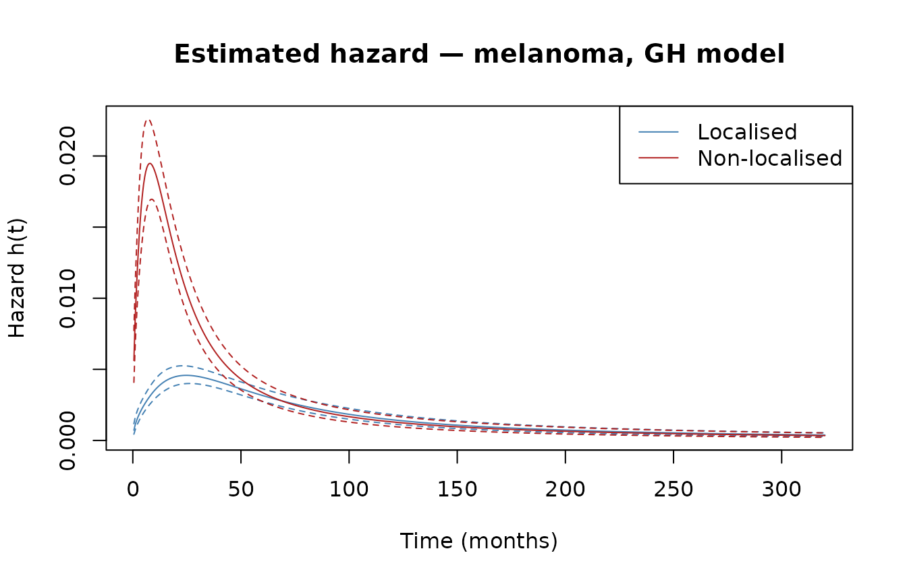
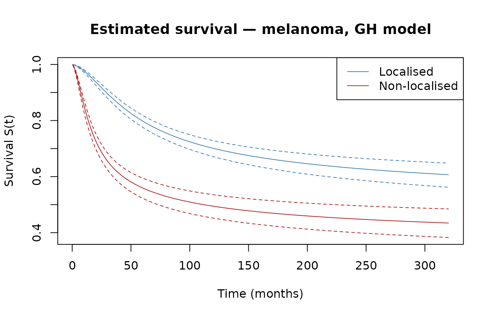
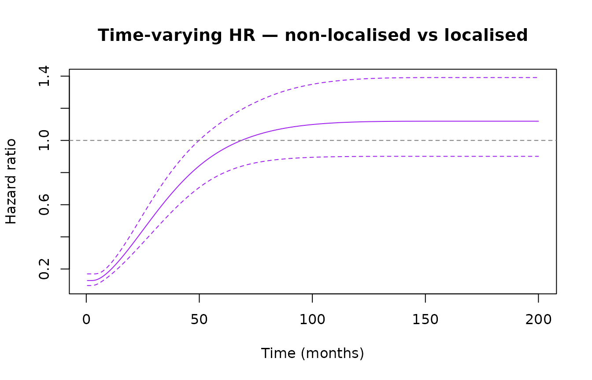
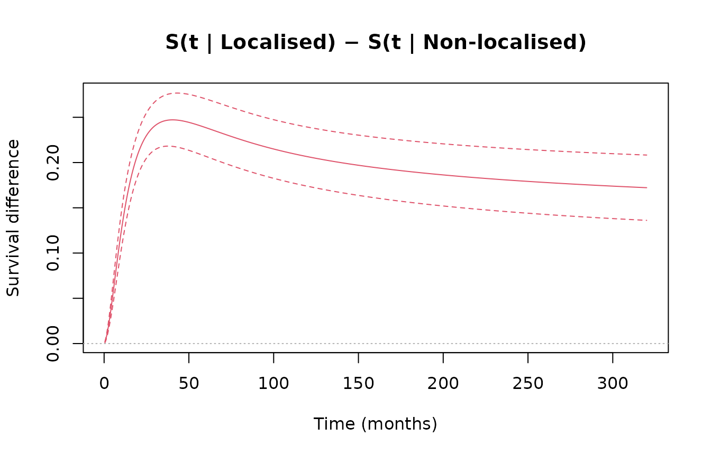

# Getting started with genhaz

## Introduction

In survival analysis, covariate effects are typically modelled through
one of two mechanisms: a multiplicative effect on the hazard
(proportional hazards, PH) or a multiplicative effect on time
(accelerated failure time, AFT). **Generalized hazard (GH) models**
combine both simultaneously:

``` math
h(t \mid x) = h_0\!\left(t\,e^{\beta_1^\top x}\right) \cdot e^{(\beta_1+\beta_2)^\top x}
```

This nests PH ($`\beta_1 = 0`$), AFT ($`\beta_2 = 0`$), and additive
hazards (AH, $`\beta_1 = -\beta_2`$) as special cases. A key advantage:
combining the time-acceleration parameter $`\beta_1`$ and the
hazard-scaling parameter $`\beta_2`$ can capture time-varying hazard
ratios with only two parameters per covariate.

`genhaz` fits penalised cubic restricted spline GH models on the
log-time scale, with the smoothing parameter selected automatically by
minimising a modified likelihood cross-validation (LCV) criterion.

## Model types

The `model_type` argument selects the sub-model per covariate:

| `model_type` | Constraint             | Interpretation           |
|--------------|------------------------|--------------------------|
| `"GH"`       | none                   | Full generalised hazard  |
| `"PH"`       | $`\beta_1 = 0`$        | Proportional hazards     |
| `"AFT"`      | $`\beta_2 = 0`$        | Accelerated failure time |
| `"AH"`       | $`\beta_1 = -\beta_2`$ | Additive hazards         |

Mixed models are supported via a vector,
e.g. `model_type = c("PH", "GH")` for two covariates.

## Censoring types

| `Surv` call | Censoring | Internal type |
|----|----|----|
| `Surv(time, event)` | Right-censoring | `"rc"` |
| `Surv(start, stop, event)` | Left-truncation + right-censoring | `"lt_rc"` |
| `Surv(t1, t2, type="interval2")` | Interval censoring | `"ic"` |

------------------------------------------------------------------------

## Real-data example: melanoma survival

We use the
[`biostat3::melanoma`](https://rdrr.io/pkg/biostat3/man/melanoma.html)
dataset: 7,775 patients with melanoma cancer, including age group,
period of diagnosis, sex, cancer stage, survival time in months, and a
death indicator. The question of interest is the effect of non-localised
stage on survival, adjusted for age, period, and sex.

### Data preparation

``` r

library(biostat3)

mel        <- biostat3::melanoma
mel$X      <- ifelse(mel$stage == "Localised", 0, 1)
mel$event  <- ifelse(mel$status == "Dead: cancer", 1, 0)
mel$time   <- mel$surv_mm
mel$period <- ifelse(mel$year8594 == "Diagnosed 75-84", 0, 1)
```

### Fitting the model

The full model fit takes approximately 9 minutes and is not re-run here.
The code below shows exactly what was run to produce the stored result:

``` r

fit_melanoma <- fit_genhaz(
  Surv(mel$time, mel$event), ~ X + period + agegrp + sex,
  data       = mel,
  model_type = "GH",
  profile    = TRUE,
  n_knots    = 8,
  tol_LCV    = 0.001,
  lcv_method = "optimize"
)
```

``` r

library(genhaz)
library(survival)
data("fit_melanoma")
```

``` r

library(biostat3)
mel        <- biostat3::melanoma
mel$X      <- ifelse(mel$stage == "Localised", 0, 1)
mel$period <- ifelse(mel$year8594 == "Diagnosed 75-84", 0, 1)
new_time   <- seq(0.5, 320, by = 0.5)   # avoids t = 0 (needed for time_ratio)

nd_mel <- data.frame(
  X      = c(0L, 1L),
  period = c(1L, 1L),
  agegrp = factor(c("60-74", "60-74"), levels = levels(mel$agegrp)),
  sex    = factor(c("Male",  "Male"),  levels = levels(mel$sex))
)
rownames(nd_mel) <- c("Localised", "Non-localised")
```

### Results

``` r

print(fit_melanoma)
#> Fitted generalized hazard model (genhaz)
#> 
#>   Model type : GH
#>   Knots      : 8 (log-time scale)
#>   Lambda     : 5970
#>   EDF        : 15.80
#>   AIC        : 24261.08
#> 
#> Covariate coefficients (Wald 95% CI):
#>                   Estimate Std.Err       z  p.value lower.95% upper.95%
#> beta1_X             1.1428  0.0857 13.3398  < 2e-16    0.9749    1.3107
#> beta1_period       -0.0711  0.0763 -0.9317  0.35150   -0.2208    0.0785
#> beta1_agegrp45-59   0.0764  0.1020  0.7492  0.45371   -0.1235    0.2764
#> beta1_agegrp60-74   0.1117  0.1002  1.1146  0.26504   -0.0847    0.3081
#> beta1_agegrp75+     0.2973  0.1190  2.4982  0.01248    0.0641    0.5306
#> beta1_sexFemale    -0.1150  0.0738 -1.5576  0.11933   -0.2597    0.0297
#> beta2_X             0.3055  0.0695  4.3925 1.12e-05    0.1692    0.4418
#> beta2_period       -0.3054  0.0655 -4.6637 3.11e-06   -0.4338   -0.1771
#> beta2_agegrp45-59   0.2457  0.0837  2.9358  0.00333    0.0817    0.4098
#> beta2_agegrp60-74   0.5377  0.0821  6.5507 5.73e-11    0.3768    0.6985
#> beta2_agegrp75+     0.8283  0.0997  8.3072  < 2e-16    0.6329    1.0238
#> beta2_sexFemale    -0.4238  0.0609 -6.9558 3.51e-12   -0.5432   -0.3044
```

``` r

summary(fit_melanoma)
#> Fitted generalized hazard model (genhaz)
#> 
#>   Formula    : ~X + period + agegrp + sex
#>   Model type : GH
#>   Knots      : 8 (log-time scale)
#>   Lambda     : 5970
#>   EDF        : 15.80
#>   AIC        : 24261.08
#> 
#> Covariate coefficients (Wald 95% CI):
#>                   Estimate Std.Err       z  p.value    lower    upper exp(Est.)
#> beta1_X            1.14275 0.08566 13.3398  < 2e-16  0.97485  1.31065    3.1354
#> beta1_period      -0.07113 0.07634 -0.9317  0.35150 -0.22076  0.07850    0.9313
#> beta1_agegrp45-59  0.07644 0.10202  0.7492  0.45371 -0.12351  0.27638    1.0794
#> beta1_agegrp60-74  0.11169 0.10021  1.1146  0.26504 -0.08472  0.30809    1.1182
#> beta1_agegrp75+    0.29734 0.11902  2.4982  0.01248  0.06406  0.53061    1.3463
#> beta1_sexFemale   -0.11502 0.07384 -1.5576  0.11933 -0.25975  0.02971    0.8913
#> beta2_X            0.30549 0.06955  4.3925 1.12e-05  0.16918  0.44180    1.3573
#> beta2_period      -0.30543 0.06549 -4.6637 3.11e-06 -0.43378 -0.17707    0.7368
#> beta2_agegrp45-59  0.24573 0.08370  2.9358  0.00333  0.08168  0.40978    1.2786
#> beta2_agegrp60-74  0.53765 0.08208  6.5507 5.73e-11  0.37679  0.69852    1.7120
#> beta2_agegrp75+    0.82835 0.09971  8.3072  < 2e-16  0.63291  1.02378    2.2895
#> beta2_sexFemale   -0.42383 0.06093 -6.9558 3.51e-12 -0.54325 -0.30440    0.6545
#>                   exp(lower) exp(upper)
#> beta1_X               2.6508     3.7086
#> beta1_period          0.8019     1.0817
#> beta1_agegrp45-59     0.8838     1.3184
#> beta1_agegrp60-74     0.9188     1.3608
#> beta1_agegrp75+       1.0662     1.7000
#> beta1_sexFemale       0.7712     1.0302
#> beta2_X               1.1843     1.5555
#> beta2_period          0.6481     0.8377
#> beta2_agegrp45-59     1.0851     1.5065
#> beta2_agegrp60-74     1.4576     2.0108
#> beta2_agegrp75+       1.8831     2.7837
#> beta2_sexFemale       0.5809     0.7376
```

Patients with non-localised disease progress through the baseline hazard
$`\exp(\hat\beta_1)`$ times faster and face a $`\exp(\hat\beta_2)`$
times higher hazard at every time point. Wald CIs for each:

``` r

waldCI(fit_melanoma, "beta1_X")
#>     lower     upper 
#> 0.9748534 1.3106536
waldCI(fit_melanoma, "beta2_X")
#>     lower     upper 
#> 0.1691757 0.4417983
```

### Hazard and survival curves

[`plot()`](https://rdrr.io/r/graphics/plot.default.html) dispatches on
the fitted model, calls
[`predict()`](https://rdrr.io/r/stats/predict.html) internally, and sets
`ylim` from the full CI range so confidence bands are never clipped.
Evaluated at age group 60–74, male sex, diagnosed 1985–94.

``` r

plot(fit_melanoma, newdata = nd_mel, times = new_time, type = "hazard",
     col  = c("steelblue", "firebrick"),
     xlab = "Time (months)", main = "Estimated hazard — melanoma, GH model")
```



``` r

plot(fit_melanoma, newdata = nd_mel, times = new_time, type = "survival",
     col  = c("steelblue", "firebrick"),
     xlab = "Time (months)", main = "Estimated survival — melanoma, GH model")
```



### Time-varying hazard ratio

`type = "hazard_ratio"` gives $`h_1(t)/h_2(t)`$ with a log-scale
delta-method CI. Under PH this would be flat; the GH model captures the
time variation. [`plot()`](https://rdrr.io/r/graphics/plot.default.html)
works directly on the
[`predict()`](https://rdrr.io/r/stats/predict.html) result.

``` r

hr_mel <- predict(fit_melanoma, newdata = nd_mel,
                  times = seq(0.5, 200, by = 0.5), type = "hazard_ratio")
plot(hr_mel, col = "purple",
     xlab = "Time (months)",
     main = "Time-varying HR — non-localised vs localised")
abline(h = 1, lty = 2, col = "grey50")
```



With only two parameters for the stage effect, the GH model captures the
time-varying hazard ratio: high at diagnosis, levelling off after
approximately 6 years.

### Survival difference and RMST

`type = "surv_diff"` gives $`S_1(t) - S_2(t)`$ on the linear scale; the
delta-method accounts for the correlation between the two curves.
`type = "rmst_diff"` integrates this difference up to each restriction
time $`\tau`$ via 25-point Gauss-Legendre quadrature.

``` r

diff_s_mel <- predict(fit_melanoma, newdata = nd_mel,
                      times = new_time, type = "surv_diff")
plot(diff_s_mel,
     xlab = "Time (months)",
     main = "S(t | Localised) − S(t | Non-localised)")
abline(h = 0, lty = 3, col = "grey70")
```



``` r


tau_mel  <- c(12, 24, 60, 120, 240)
rmst_mel <- predict(fit_melanoma, newdata = nd_mel,
                    times = tau_mel, type = "rmst_diff")
rmst_mel
#>                     pattern time   estimate      lower      upper
#> 1 Localised - Non-localised   12  0.8138883  0.6703554  0.9574212
#> 2 Localised - Non-localised   24  3.1478871  2.7446971  3.5510771
#> 3 Localised - Non-localised   60 11.8855268 10.5725970 13.1984567
#> 4 Localised - Non-localised  120 25.1408642 22.0427350 28.2389935
#> 5 Localised - Non-localised  240 48.0778932 41.1811933 54.9745930
```

### Time ratio

`type = "time_ratio"` gives $`\tau/t`$ where $`S_2(\tau) = S_1(t)`$: how
much longer does the non-localised group need to reach the same survival
level as the localised group at time $`t`$? Each $`\tau`$ is found via
`uniroot`; the delta-method CI uses the implicit function theorem. This
is computationally intensive, so the chunk is not evaluated during
build.

``` r

tr_mel <- predict(fit_melanoma, newdata = nd_mel,
                  times = seq(6, 240, by = 6), type = "time_ratio")
plot(tr_mel, col = "darkorange",
     xlab = "Time (months)", main = "Time ratio — non-localised vs localised")
abline(h = 1, lty = 2, col = "grey50")
```

------------------------------------------------------------------------

## Simulation and benchmarking

[`sim_scenario()`](https://aaronjehle.github.io/genhaz/reference/sim_scenario.md)
generates right-censored survival data from one of three named scenarios
with mixture-Weibull baseline hazards (bathtub, hump-shaped, early
peak).
[`mixWeibSc()`](https://aaronjehle.github.io/genhaz/reference/mixWeibSc.md)
evaluates the corresponding true $`h`$, $`H`$, and $`S`$ on a grid for
comparison with fitted estimates.

``` r

set.seed(42)
dat <- sim_scenario(scenario = 1, beta1 = 0.5, beta2 = 0.5, n = 500)
head(dat)
#>        time X event    T_true
#> 1 1.5137723 1     1 1.5137723
#> 2 0.6274633 1     0 1.4308403
#> 3 1.9735251 0     1 1.9735251
#> 4 0.6619293 1     1 0.6619293
#> 5 1.5659811 1     1 1.5659811
#> 6 0.2222732 1     0 0.5267612
```

``` r

fit <- fit_genhaz(
  surv       = Surv(dat$time, dat$event),
  formula    = ~ X,
  data       = dat,
  model_type = "GH",
  profile    = TRUE,
  n_knots    = 6,
  tol_LCV    = 0.05,
  lcv_method = "optimize"
)
```

``` r

print(fit)
#> Fitted generalized hazard model (genhaz)
#> 
#>   Model type : GH
#>   Knots      : 6 (log-time scale)
#>   Lambda     : 362.7
#>   EDF        : 5.89
#>   AIC        : 877.97
#> 
#> Covariate coefficients (Wald 95% CI):
#>         Estimate Std.Err      z  p.value lower.95% upper.95%
#> beta1_X   0.2033  0.1521 1.3364 0.181419   -0.0949    0.5015
#> beta2_X   1.2617  0.3713 3.3983 0.000678    0.5340    1.9894
```

### Inference

[`waldCI()`](https://aaronjehle.github.io/genhaz/reference/waldCI.md)
computes a Wald CI for a single parameter;
[`waldCI_minus()`](https://aaronjehle.github.io/genhaz/reference/waldCI_minus.md)
gives a CI for $`\beta_1 - \beta_2`$ (accounting for their covariance).

``` r

waldCI(fit, "beta1_X")
#>       lower       upper 
#> -0.09487388  0.50153255
waldCI(fit, "beta2_X")
#>     lower     upper 
#> 0.5340138 1.9894184
waldCI_minus(fit, "beta1_X", "beta2_X")
#>       lower       upper 
#> -2.07437271 -0.04240081
```

Fit a restricted (PH) model and test against the full GH model:

``` r

fit_ph <- fit_genhaz(
  surv       = Surv(dat$time, dat$event),
  formula    = ~ X,
  data       = dat,
  model_type = "PH",
  profile    = TRUE,
  n_knots    = 6,
  tol_LCV    = 0.05,
  lcv_method = "optimize"
)

LR(fit_ph, fit)
#> LR-statistic      p_value 
#>   5.68044586   0.01715501
```

------------------------------------------------------------------------

## Smoothing-parameter selection

The smoothing parameter $`\lambda`$ is chosen by minimising the modified
LCV criterion. Three strategies are available via `lcv_method`:

| `lcv_method` | Method | Notes |
|----|----|----|
| `"full"` (default) | Root-find on full LCV gradient (third-derivative correction) | Most accurate |
| `"approx"` | Root-find on first-order LCV gradient | Faster |
| `"optimize"` | Direct [`optimize()`](https://rdrr.io/r/stats/optimize.html) on LCV, no gradient | Gradient-free |

``` r

# First-order gradient (faster)
fit <- fit_genhaz(..., profile = TRUE, lcv_method = "approx")

# Pure optimisation (no gradient)
fit <- fit_genhaz(..., profile = TRUE, lcv_method = "optimize")
```
