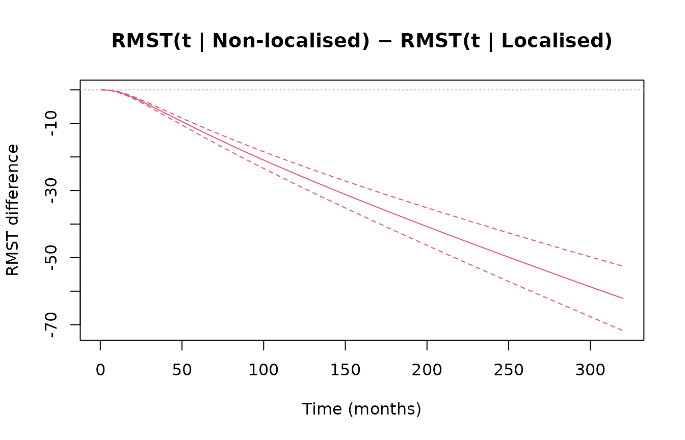
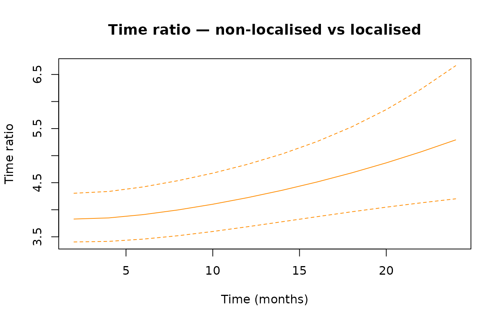
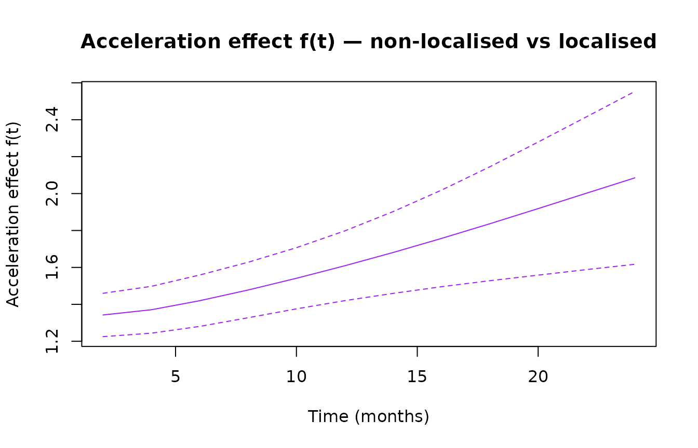

# Getting started with genhaz

## Introduction

In survival analysis, covariate effects are typically modelled through
one of two mechanisms: a multiplicative effect on the hazard
(proportional hazards, PH) or a multiplicative effect on time
(accelerated failure time, AFT). **Generalized hazard (GH) models**
combine both simultaneously:

``` math
h(t \mid x) = h_0\!\left(t\,e^{\beta_1^\top x}\right) \cdot e^{(\beta_1+\beta_2)^\top x}
```

This nests PH ($`\beta_1 = 0`$), AFT ($`\beta_2 = 0`$), and additive
hazards (AH, $`\beta_1 = -\beta_2`$) as special cases. A key advantage:
combining the time-acceleration parameter $`\beta_1`$ and the
hazard-scaling parameter $`\beta_2`$ can capture time-varying hazard
ratios with only two parameters per covariate.

`genhaz` fits penalised cubic restricted spline GH models on the
log-time scale, with the smoothing parameter selected automatically by
minimising a modified likelihood cross-validation (LCV) criterion.

## Model types

The `model_type` argument selects the sub-model per covariate:

| `model_type` | Constraint             | Interpretation           |
|--------------|------------------------|--------------------------|
| `"GH"`       | none                   | Full generalised hazard  |
| `"PH"`       | $`\beta_1 = 0`$        | Proportional hazards     |
| `"AFT"`      | $`\beta_2 = 0`$        | Accelerated failure time |
| `"AH"`       | $`\beta_1 = -\beta_2`$ | Additive hazards         |

Mixed models are supported via a vector,
e.g. `model_type = c("PH", "GH")` for two covariates.

## Censoring types

| `Surv` call | Censoring | Internal type |
|----|----|----|
| `Surv(time, event)` | Right-censoring | `"rc"` |
| `Surv(start, stop, event)` | Left-truncation + right-censoring | `"lt_rc"` |
| `Surv(t1, t2, type="interval2")` | Interval censoring | `"ic"` |

------------------------------------------------------------------------

Note: only rc is tested at this point in time.

## Real-data example: melanoma survival

We use the
[`biostat3::melanoma`](https://rdrr.io/pkg/biostat3/man/melanoma.html)
dataset: 7,775 patients with melanoma cancer, including age group,
period of diagnosis, sex, cancer stage, survival time in months, and a
death indicator. The question of interest is the effect of non-localised
stage on survival, adjusted for age, period, and sex.

### Data preparation

``` r

library(biostat3)

mel        <- biostat3::melanoma
mel$X      <- ifelse(mel$stage == "Localised", 0, 1)
mel$event  <- ifelse(mel$status == "Dead: cancer", 1, 0)
mel$time   <- mel$surv_mm
mel$period <- ifelse(mel$year8594 == "Diagnosed 75-84", 0, 1)
```

### Fitting the model

The full model fit takes approximately 9 minutes and is not re-run here.
The code below shows exactly what was run to produce the stored result:

``` r

fit_melanoma <- fit_genhaz(
  Surv(mel$time, mel$event), ~ X + period + agegrp + sex,
  data       = mel,
  model_type = "GH",
  profile    = TRUE,
  n_knots    = 8,
  tol_LCV    = 0.001,
  lcv_method = "optimize"
)
```

``` r

library(genhaz)
library(survival)
data("fit_melanoma")
```

``` r

library(biostat3)
mel        <- biostat3::melanoma
mel$X      <- ifelse(mel$stage == "Localised", 0, 1)
mel$period <- ifelse(mel$year8594 == "Diagnosed 75-84", 0, 1)
new_time   <- seq(0.5, 320, by = 0.5)   # avoids t = 0 (needed for time_ratio)

nd_mel <- data.frame(
  X      = c(1L, 0L),
  period = c(1L, 1L),
  agegrp = factor(c("60-74", "60-74"), levels = levels(mel$agegrp)),
  sex    = factor(c("Male",  "Male"),  levels = levels(mel$sex))
)
rownames(nd_mel) <- c("Non-Localised", "Localised")
```

### Results

``` r

print(fit_melanoma)
#> Fitted generalized hazard model (genhaz)
#> 
#>   Model type : GH
#>   Knots      : 8 (log-time scale)
#>   Lambda     : 5970
#>   EDF        : 15.80
#>   AIC        : 24261.08
#> 
#> Covariate coefficients:
#>                   Estimate  Std.Err      z Pr(>|z|)    
#> beta1_X            1.14275  0.08566 13.340  < 2e-16 ***
#> beta1_period      -0.07113  0.07634 -0.932  0.35150    
#> beta1_agegrp45-59  0.07644  0.10202  0.749  0.45371    
#> beta1_agegrp60-74  0.11169  0.10021  1.115  0.26504    
#> beta1_agegrp75+    0.29734  0.11902  2.498  0.01248 *  
#> beta1_sexFemale   -0.11502  0.07384 -1.558  0.11933    
#> beta2_X            0.30549  0.06955  4.392 1.12e-05 ***
#> beta2_period      -0.30543  0.06549 -4.664 3.11e-06 ***
#> beta2_agegrp45-59  0.24573  0.08370  2.936  0.00333 ** 
#> beta2_agegrp60-74  0.53765  0.08208  6.551 5.73e-11 ***
#> beta2_agegrp75+    0.82835  0.09971  8.307  < 2e-16 ***
#> beta2_sexFemale   -0.42383  0.06093 -6.956 3.51e-12 ***
#> ---
#> Signif. codes:  0 '***' 0.001 '**' 0.01 '*' 0.05 '.' 0.1 ' ' 1
#> 
#> Exponentiated estimates (95% CI):
#>                   exp(Est) lower .95 upper .95
#> beta1_X             3.1354    2.6508    3.7086
#> beta1_period        0.9313    0.8019    1.0817
#> beta1_agegrp45-59   1.0794    0.8838    1.3184
#> beta1_agegrp60-74   1.1182    0.9188    1.3608
#> beta1_agegrp75+     1.3463    1.0662    1.7000
#> beta1_sexFemale     0.8913    0.7712    1.0302
#> beta2_X             1.3573    1.1843    1.5555
#> beta2_period        0.7368    0.6481    0.8377
#> beta2_agegrp45-59   1.2786    1.0851    1.5065
#> beta2_agegrp60-74   1.7120    1.4576    2.0108
#> beta2_agegrp75+     2.2895    1.8831    2.7837
#> beta2_sexFemale     0.6545    0.5809    0.7376
```

``` r

summary(fit_melanoma)
#> Fitted generalized hazard model (genhaz)
#> 
#>   Formula    : ~X + period + agegrp + sex
#>   Model type : GH
#>   Knots      : 8 (log-time scale)
#>   Lambda     : 5970
#>   EDF        : 15.80
#>   AIC        : 24261.08
#> 
#> Covariate coefficients:
#>                   Estimate  Std.Err      z Pr(>|z|)    
#> beta1_X            1.14275  0.08566 13.340  < 2e-16 ***
#> beta1_period      -0.07113  0.07634 -0.932  0.35150    
#> beta1_agegrp45-59  0.07644  0.10202  0.749  0.45371    
#> beta1_agegrp60-74  0.11169  0.10021  1.115  0.26504    
#> beta1_agegrp75+    0.29734  0.11902  2.498  0.01248 *  
#> beta1_sexFemale   -0.11502  0.07384 -1.558  0.11933    
#> beta2_X            0.30549  0.06955  4.392 1.12e-05 ***
#> beta2_period      -0.30543  0.06549 -4.664 3.11e-06 ***
#> beta2_agegrp45-59  0.24573  0.08370  2.936  0.00333 ** 
#> beta2_agegrp60-74  0.53765  0.08208  6.551 5.73e-11 ***
#> beta2_agegrp75+    0.82835  0.09971  8.307  < 2e-16 ***
#> beta2_sexFemale   -0.42383  0.06093 -6.956 3.51e-12 ***
#> ---
#> Signif. codes:  0 '***' 0.001 '**' 0.01 '*' 0.05 '.' 0.1 ' ' 1
#> 
#> Exponentiated estimates (95% CI):
#>                   exp(Est) lower .95 upper .95
#> beta1_X             3.1354    2.6508    3.7086
#> beta1_period        0.9313    0.8019    1.0817
#> beta1_agegrp45-59   1.0794    0.8838    1.3184
#> beta1_agegrp60-74   1.1182    0.9188    1.3608
#> beta1_agegrp75+     1.3463    1.0662    1.7000
#> beta1_sexFemale     0.8913    0.7712    1.0302
#> beta2_X             1.3573    1.1843    1.5555
#> beta2_period        0.7368    0.6481    0.8377
#> beta2_agegrp45-59   1.2786    1.0851    1.5065
#> beta2_agegrp60-74   1.7120    1.4576    2.0108
#> beta2_agegrp75+     2.2895    1.8831    2.7837
#> beta2_sexFemale     0.6545    0.5809    0.7376
```

Patients with non-localised disease progress through the baseline hazard
$`\exp(\hat\beta_1)`$ times faster and face a $`\exp(\hat\beta_2)`$
times higher hazard at every time point. Wald CIs for each:

``` r

confint(fit_melanoma, "beta1_X")
#>             2.5 %   97.5 %
#> beta1_X 0.9748534 1.310654
confint(fit_melanoma, "beta2_X")
#>             2.5 %    97.5 %
#> beta2_X 0.1691757 0.4417983
```

### Hazard and survival curves

[`plot()`](https://rdrr.io/r/graphics/plot.default.html) dispatches on
the fitted model, calls
[`predict()`](https://rdrr.io/r/stats/predict.html) internally, and sets
`ylim` from the full CI range so confidence bands are never clipped.
Evaluated at age group 60–74, male sex, diagnosed 1985–94.

``` r

plot(fit_melanoma, newdata = nd_mel, times = new_time, type = "hazard",
     interval = "confidence", col = c("steelblue", "firebrick"),
     xlab = "Time (months)", main = "Estimated hazard — melanoma, GH model")
```


``` r

plot(fit_melanoma, newdata = nd_mel, times = new_time, type = "survival",
     interval = "confidence", col = c("steelblue", "firebrick"),
     xlab = "Time (months)", main = "Estimated survival — melanoma, GH model")
```


### Time-varying hazard ratio

`type = "hazard_ratio"` gives $`h_1(t)/h_0(t)`$ (exposed over baseline)
with a log-scale delta-method CI. Under PH this would be flat; the GH
model captures the time variation.
[`plot()`](https://rdrr.io/r/graphics/plot.default.html) works directly
on the [`predict()`](https://rdrr.io/r/stats/predict.html) result.

``` r

hr_mel <- predict(fit_melanoma, newdata = nd_mel,
                  times = seq(0.5, 200, by = 0.5), type = "hazard_ratio",
                  interval = "confidence")
plot(hr_mel, col = "purple",
     xlab = "Time (months)",
     main = "Time-varying HR — non-localised vs localised")
abline(h = 1, lty = 2, col = "grey50")
```


With only two parameters for the stage effect, the GH model captures the
time-varying hazard ratio: high at diagnosis, levelling off after
approximately 6 years.

### Survival difference and RMST

`type = "surv_diff"` gives $`S_1(t) - S_0(t)`$ (exposed minus baseline)
on the linear scale; the delta-method accounts for the correlation
between the two curves. `type = "rmst_diff"` integrates this difference
up to each restriction time $`\tau`$ via 25-point Gauss-Legendre
quadrature.

``` r

diff_s_mel <- predict(fit_melanoma, newdata = nd_mel,
                      times = new_time, type = "surv_diff",
                      interval = "confidence")
plot(diff_s_mel,
     xlab = "Time (months)",
     main = "S(t | Non-localised) − S(t | Localised)")
abline(h = 0, lty = 3, col = "grey70")
```


``` r


rmst_mel <- predict(fit_melanoma, newdata = nd_mel,
                    times = new_time, type = "rmst_diff",
                    interval = "confidence")
plot(rmst_mel,
     xlab = "Time (months)",
     main = "RMST(t | Non-localised) − RMST(t | Localised)")
abline(h = 0, lty = 3, col = "grey70")
```



### Time ratio

`type = "time_ratio"` gives $`\tau/t`$ where $`S_0(\tau) = S_1(t)`$ (the
relation $`S(t\mid x_1)=S_0(\tau(t))`$): the baseline time $`\tau`$ at
which the localised (baseline, group 0, row 2) group reaches the
survival level the non-localised (exposed, group 1, row 1) group has at
time $`t`$. The non-localised group fares worse, so the localised group
needs *longer* to fall that far, giving $`\tau > t`$. Each $`\tau`$ is
found via `uniroot`; the delta-method CI uses the implicit function
theorem. The search is capped at the model support `exp(max(fit$knots))`
(`tau_max`); the localised baseline survival plateaus above the
non-localised level, so beyond an early window no $`\tau`$ exists
(returned `NA`) — we therefore use an in-support grid.

``` r

tr_mel <- predict(fit_melanoma, newdata = nd_mel,
                  times = seq(2, 24, by = 2), type = "time_ratio",
                  interval = "confidence")
plot(tr_mel, col = "darkorange",
     xlab = "Time (months)", main = "Time ratio — non-localised vs localised")
abline(h = 1, lty = 2, col = "grey50")
```



### Acceleration factor

`type = "acc_factor"` reports the time-varying acceleration **effect**
on the log scale,
``` math
f(t) = \log \tau'(t) = \log h_1(t) - \log h_0(\tau(t)),
```
the time-varying analogue of $`\beta_1`$: it is defined so that
``` math
S(t \mid x_1) = S_0\!\left(\int_0^t e^{f(u)\,X}\,du\right),
```
i.e. the warped time is $`\tau(t)=\int_0^t e^{f(u)X}du`$ with
instantaneous rate $`e^{f(t)X}=\tau'(t)`$, and $`f(t)=\beta_1`$ in the
constant-AFT limit. So $`f(t)`$ is directly comparable to the fitted
$`\hat\beta_1`$ (here $`\approx 1.14`$). The delta-method CI uses the
implicit function theorem together with the hazard time-derivative
`post(..., "dh_dt")`; the same support cap applies, so we use the
in-support grid.

This is a work in progress.

``` r

af_mel <- predict(fit_melanoma, newdata = nd_mel,
                  times = seq(2, 24, by = 2), type = "acc_factor",
                  interval = "confidence")
plot(af_mel, col = "purple",
     xlab = "Time (months)", main = "Acceleration effect f(t) — non-localised vs localised")
abline(h = fit_melanoma$par["beta1_X"], lty = 2, col = "grey50")  # constant-AFT beta1
```



## Simulation and benchmarking

[`sim_scenario()`](https://aaronjehle.github.io/genhaz/reference/sim_scenario.md)
generates right-censored survival data from one of three named scenarios
with mixture-Weibull baseline hazards (bathtub, hump-shaped, early
peak).
[`mixWeibSc()`](https://aaronjehle.github.io/genhaz/reference/mixWeibSc.md)
evaluates the corresponding true $`h`$, $`H`$, and $`S`$ on a grid for
comparison with fitted estimates.

``` r

set.seed(82359)
dat <- sim_scenario(scenario = 1, beta1 = 0.5, beta2 = 0.5, n = 2000)
head(dat)
#>        time X event    T_true
#> 1 2.1526916 0     1 2.1526916
#> 2 3.1407413 0     1 3.1407413
#> 3 0.4359473 0     0 1.8678244
#> 4 1.5510083 1     1 1.5510083
#> 5 0.4094107 0     1 0.4094107
#> 6 1.2020419 1     1 1.2020419
```

``` r

fit <- fit_genhaz(
  surv       = Surv(dat$time, dat$event),
  formula    = ~ X,
  data       = dat,
  model_type = "GH",
  profile    = TRUE,
  n_knots    = 6,
  tol_LCV    = 0.05,
  lcv_method = "optimize"
)
```

``` r

print(fit)
#> Fitted generalized hazard model (genhaz)
#> 
#>   Model type : GH
#>   Knots      : 6 (log-time scale)
#>   Lambda     : 287.4
#>   EDF        : 6.91
#>   AIC        : 3521.11
#> 
#> Covariate coefficients:
#>         Estimate Std.Err     z Pr(>|z|)    
#> beta1_X  0.45585 0.04649 9.806  < 2e-16 ***
#> beta2_X  0.61353 0.11273 5.442 5.26e-08 ***
#> ---
#> Signif. codes:  0 '***' 0.001 '**' 0.01 '*' 0.05 '.' 0.1 ' ' 1
#> 
#> Exponentiated estimates (95% CI):
#>         exp(Est) lower .95 upper .95
#> beta1_X   1.5775    1.4401    1.7280
#> beta2_X   1.8469    1.4808    2.3036
```

### Inference

[`confint()`](https://rdrr.io/r/stats/confint.html) gives Wald CIs for
the parameters; with `diff = TRUE` it returns a CI for
$`\beta_1 - \beta_2`$ (accounting for their covariance).

``` r

confint(fit, "beta1_X")
#>             2.5 %    97.5 %
#> beta1_X 0.3647416 0.5469618
confint(fit, "beta2_X")
#>             2.5 %    97.5 %
#> beta2_X 0.3925786 0.8344796
confint(fit, c("beta1_X", "beta2_X"), diff = TRUE)
#>                        2.5 %    97.5 %
#> beta1_X - beta2_X -0.4629392 0.1475844
```

Fit a restricted (PH) model and test against the full GH model:

``` r

fit_ph <- fit_genhaz(
  surv       = Surv(dat$time, dat$event),
  formula    = ~ X,
  data       = dat,
  model_type = "PH",
  profile    = TRUE,
  n_knots    = 6,
  tol_LCV    = 0.05,
  lcv_method = "optimize"
)

anova(fit_ph, fit)
#> Analysis of Deviance Table (likelihood ratio tests)
#> 
#>  Model 1: ~X, PH
#>  Model 2: ~X, GH
#>         Df  LogLik  Chisq Chi Df Pr(>Chisq)    
#> Model 1  7 -1790.4                             
#> Model 2  8 -1756.6 67.608      1  < 2.2e-16 ***
#> ---
#> Signif. codes:  0 '***' 0.001 '**' 0.01 '*' 0.05 '.' 0.1 ' ' 1
```

------------------------------------------------------------------------

## Smoothing-parameter selection

The smoothing parameter $`\lambda`$ is chosen by minimising the modified
LCV criterion. Three strategies are available via `lcv_method`:

| `lcv_method` | Method | Notes |
|----|----|----|
| `"full"` (default) | Root-find on full LCV gradient (third-derivative correction) | Most accurate |
| `"approx"` | Root-find on first-order LCV gradient | Faster |
| `"optimize"` | Direct [`optimize()`](https://rdrr.io/r/stats/optimize.html) on LCV, no gradient | Gradient-free |

``` r

# First-order gradient (faster)
fit <- fit_genhaz(..., profile = TRUE, lcv_method = "approx")

# Pure optimisation (no gradient)
fit <- fit_genhaz(..., profile = TRUE, lcv_method = "optimize")
```
