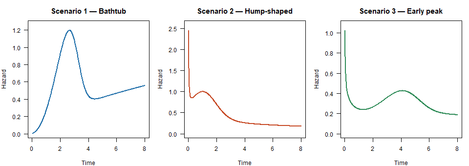
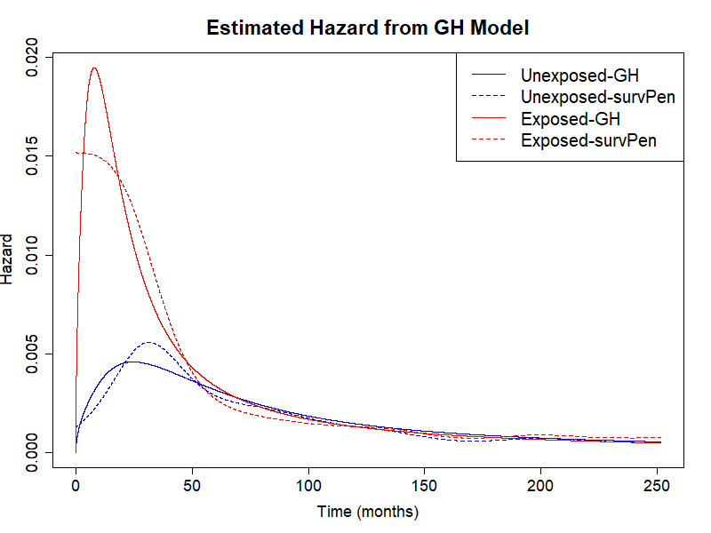
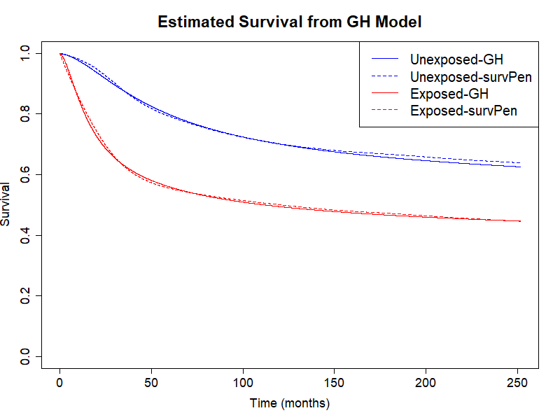
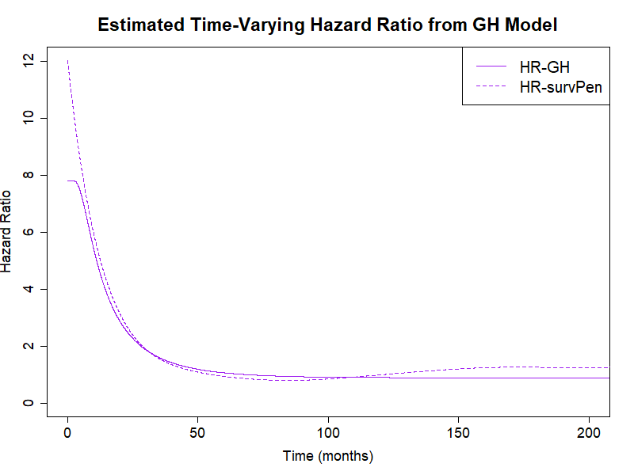

# genhaz

**Penalised Flexible-Parametric Generalized Hazard Models for Survival Analysis**

In survival analysis, quantifying covariate effects typically relies on one of
two complementary frameworks. The **Cox proportional hazards (PH) model** acts
multiplicatively on the instantaneous hazard — h(t|x) = h₀(t)·exp(β′x) — and
requires the covariate effect to remain constant over time, an assumption that
is often difficult to justify in practice. **Accelerated failure time (AFT)
models** instead model covariate effects on the time scale, describing survival
as an accelerated or decelerated version of a baseline —
h(t|x) = h₀(t·exp(β′x))·exp(β′x). The lesser-known **accelerated hazards
(AH) models** describe a pure time-acceleration with no accompanying
hazard-scale change: h(t|x) = h₀(t·exp(β′x)).

There is no fundamental reason why a covariate effect should be restricted to
only one of these scales. **Generalized hazards (GH) models** (also "extended
hazards") combine both mechanisms:

    h(t|x) = h₀(t·exp(β₁′x)) · exp((β₁+β₂)′x)

This nests PH (β₁ = 0), AFT (β₂ = 0), and AH (β₁ = −β₂) as special cases.
A key property: combining the time-constant acceleration parameter β₁ and the
time-constant hazard-scaling parameter β₂ may allow the GH model to capture
time-varying hazard ratios with only two parameters per covariate.

Despite these attractive properties, no flexible parametric implementation of
GH models with regularisation to avoid overfitting previously existed.
`genhaz` fills this gap: it fits penalised cubic restricted spline GH models
with a log-time baseline, where the smoothing parameter is selected
automatically by minimising a modified likelihood cross-validation (LCV)
criterion. Simulation studies showed that the log-time spline formulation is
critical for accurately capturing rapidly varying early hazards.

Link to paper here once published.

## Installation

```r
# From source (inside the package directory):
devtools::install(".")

# Or build and install the tarball:
devtools::build()
install.packages("genhaz_0.1.0.tar.gz", repos = NULL, type = "source")
```

**Required system tools:** a C++ compiler and the Rtools toolchain (Windows)
or Xcode command-line tools (macOS).

## Dependencies

| Package | Role |
|---------|------|
| `Rcpp` / `RcppArmadillo` | C++ spline implementation |
| `survival` | `Surv` objects |

Optional: `survPen` (for `lambda_surv = TRUE` or comparison plots),
`rstpm2` (for `translate_time()`), `biostat3` (melanoma example below).

---

## Quick start

```r
library(genhaz)
library(survival)

set.seed(42)
dat <- sim_szenario(szenario = 1, beta1 = 0.5, beta2 = 0.5, n = 500)

# Fit a GH model with automatic smoothing (LCV)
fit <- fit_genhaz(
  surv       = Surv(dat$time, dat$event),
  formula    = ~ X,
  data       = dat,
  model_type = "GH",
  profile    = TRUE,   # optimise lambda via LCV
  n_knots    = 8,
  tol_LCV    = 0.01
)

fit$par
fit$se

# Pointwise hazard and survival with 95 % confidence bands
t_grid       <- seq(0.01, 8, length.out = 300)
ci_unexposed <- CI(fit, t_grid, covariate = 0)
ci_exposed   <- CI(fit, t_grid, covariate = 1)

plot(ci_unexposed$time, ci_unexposed$h, type = "l", col = "blue",
     xlab = "Time", ylab = "Hazard")
lines(ci_exposed$time, ci_exposed$h, col = "red")
legend("topright", c("X = 0", "X = 1"), col = c("blue", "red"), lty = 1)
```

---

## S3 methods for fitted models

All objects returned by `fit_genhaz()` have class `"genhaz_fit"` and come
with standard R generics.

**Inspect the fit**

```r
print(fit)        # model type, lambda, EDF, AIC, coefficient table with Wald CIs
summary(fit)      # as above plus exponentiated estimates exp(beta1), exp(beta2)
```

**Predict** hazard, survival, or cumulative hazard over a time grid — one
row of `newdata` per covariate pattern, row names become group labels:

```r
nd <- data.frame(X = c(0, 1))
rownames(nd) <- c("X = 0", "X = 1")

pred <- predict(fit, newdata = nd, times = t_grid, type = "survival")
# returns a data.frame: pattern | time | estimate | lower | upper
```

**Plot** with automatic colours and delta-method confidence bands:

```r
plot(fit, newdata = nd, times = t_grid)                  # hazard (default)
plot(fit, newdata = nd, times = t_grid, type = "survival")
plot(fit, newdata = nd, times = t_grid, col = c("steelblue", "firebrick"))
```

---

## Model types

The `model_type` argument selects the sub-model for each covariate:

| `model_type` | Constraint | Interpretation |
|---|---|---|
| `"GH"` | none | Full general hazard |
| `"PH"` | β₁ = 0 | Proportional hazards |
| `"AFT"` | β₂ = 0 | Accelerated failure time |
| `"AH"` | β₁ = −β₂ | Additive hazards |

Mixed models are supported via a vector, e.g.
`model_type = c("PH", "GH")` for two covariates.

---

## Censoring types

| `Surv` call | Censoring | Internal type |
|---|---|---|
| `Surv(time, event)` | Right-censoring | `"rc"` |
| `Surv(start, stop, event)` | Left-truncation + right-censoring | `"lt_rc"` |
| `Surv(t1, t2, type="interval2")` | Interval censoring | `"ic"` |

---

## Simulation scenarios

`genhaz` ships three mixture Weibull baseline scenarios with qualitatively
different hazard shapes for benchmarking.

Each true baseline hazard follows a two-component Weibull mixture:

$$h_0(t) = \frac{p\,\lambda_1\gamma_1 t^{\gamma_1-1}e^{-\lambda_1 t^{\gamma_1}} + (1-p)\,\lambda_2\gamma_2 t^{\gamma_2-1}e^{-\lambda_2 t^{\gamma_2}}}{p\,e^{-\lambda_1 t^{\gamma_1}}+(1-p)\,e^{-\lambda_2 t^{\gamma_2}}}$$

| Scenario | Baseline shape | Parameters |
|---|---|---|
| 1 | Bathtub | p = 0.8, λ₁ = λ₂ = 0.1, γ₁ = 3, γ₂ = 1.6 |
| 2 | Hump-shaped | p = 0.5, λ₁ = λ₂ = 1, γ₁ = 1.5, γ₂ = 0.5 |
| 3 | Early peak | p = 0.26, λ₁ = 0.02, λ₂ = 0.5, γ₁ = 3, γ₂ = 0.7 |



The covariate effect enters as a generalised hazard:
h(t|X) = h₀(t · exp(β₁X)) · exp((β₁ + β₂)X).

```r
# Simulate from scenario 1 (bathtub baseline)
dat1 <- sim_szenario(1, beta1 = 0.5, beta2 = 0.5, n = 1000)

# Evaluate the true hazard on a grid
t_grid <- seq(0.01, 8, length.out = 300)
h_true <- mixWeibSz(1, "h", t_grid, X = 0, beta1 = 0.5, beta2 = 0.5)
```

---

## Real-data example: melanoma survival

We use the `biostat3::melanoma` dataset, a synthetic dataset mimicking
melanoma cancer patient survival for a Nordic population. It contains 3,680
female and 4,095 male patients together with age, year of diagnosis, stage of
cancer progression (localised, regional, distant, unknown), observed survival
time in months, and an end-of-follow-up status indicator.

The question of interest is the effect of non-localised cancer stage at
diagnosis on survival. Age (grouped as 0–44, 45–59, 60–74, 75+), period of
diagnosis (1975–84 vs 1985–94), and sex are treated as confounders.

### Model

The GH model for this application is

```
h(t | age, period, sex, stage) =
    h₀( t · exp(β₁_stage · 1[stage≠loc] + β₁_con' X) )
    · exp( (β₁_stage + β₂_stage) · 1[stage≠loc] + (β₁_con + β₂_con)' X )
```

where X = (1[period=1985–94], 1[age∈45–59], 1[age∈60–74], 1[age≥75],
1[sex=male])'.

### Data preparation and fitting

```r
library(genhaz)
library(survival)
library(biostat3)

set.seed(23234)

mel        <- biostat3::melanoma
mel$X      <- ifelse(mel$stage == "Localised", 0, 1)
mel$event  <- ifelse(mel$status == "Dead: cancer", 1, 0)
mel$time   <- mel$surv_mm
mel$period <- ifelse(mel$year8594 == "Diagnosed 75-84", 0, 1)

fit_adj <- fit_genhaz(
  Surv(mel$time, mel$event), ~ X + period + agegrp + sex,
  data       = mel,
  model_type = "GH",
  profile    = TRUE,
  n_knots    = 8,
  tol_LCV    = 0.001,
  timeIt     = TRUE,
  lcv_method = "optimize"
)

fit_adj$par
fit_adj$se
```

### Results

Confidence intervals are computed via the delta method through `CI()`.
The covariate vector follows the column order of the design matrix; the plots
below evaluate at age group 60–74, male sex, diagnosed 1985–94, and overlay
estimates from `survPen` (dashed lines) for comparison.

```r
tlim     <- max(mel$time)
new.time <- seq(0, tlim, by = 0.01)

# Covariate vectors: (X, period, agegrp=60-74, sex=Male dummies)
CIs_adj     <- CI(fit_adj, new.time, c(0, 1, 0, 1, 0, 0), alpha = 0.05)
CIs_exp_adj <- CI(fit_adj, new.time, c(1, 1, 0, 1, 0, 0), alpha = 0.05)
```

#### Estimated hazard curves



Since the GH model imposes a common baseline hazard shape starting at 0, there
is a slight misspecification at early times; this is negligible when
considering the overall survival curves (see below).

The estimates for the stage effect are **β̂₁ = 1.14** (95% CI: 0.97, 1.31)
and **β̂₂ = 0.31** (95% CI: 0.17, 0.44). Patients with non-localised disease
progress through the baseline hazard exp(1.14) = **3.14 times faster** and
experience a exp(0.31) = **1.36 times higher hazard** at every time point.

#### Estimated survival curves

```r
plot(CIs_adj$time, CIs_adj$S, type = "l", col = "blue",
     xlim = c(0, max(mel$time)),
     xlab = "Time (months)", ylab = "Survival",
     main = "Estimated Survival — Adjusted GH Model")
lines(CIs_exp_adj$time, CIs_exp_adj$S, col = "red")
legend("topright",
       legend = c("Localised (X=0)", "Non-localised (X=1)"),
       col = c("blue", "red"), lty = 1)
```



#### Time-varying hazard ratio

```r
hr_gh <- CIs_exp_adj$h / CIs_adj$h

plot(new.time, hr_gh, type = "l", col = "purple",
     xlim = c(0, 200), xlab = "Time (months)", ylab = "Hazard ratio",
     main = "Time-Varying Hazard Ratio — Non-localised vs Localised")
abline(h = 1, lty = 2, col = "grey50")
```



With only two parameters (β₁, β₂) for the stage effect, the GH model captures
most of the time-variation in the hazard ratio recovered by `survPen` fully
flexibly. Both models agree that the hazard ratio starts high and levels off
after approximately 6 years.

---

## Smoothing-parameter selection

The smoothing parameter λ is chosen by minimising the modified LCV criterion.
Three optimisation strategies are available via the `lcv_method` argument:

| `lcv_method` | Method | Notes |
|---|---|---|
| `"full"` (default) | Root-find on full LCV gradient (third-derivative of log-likelihood correction) | Accurate |
| `"approx"` | Root-find on approximate LCV gradient | Faster |
| `"optimize"` | Direct `optimize()` on LCV, no gradient | Gradient-free |

```r
# Faster first-order gradient
fit <- fit_genhaz(..., profile = TRUE, lcv_method = "approx")

# Pure optimisation (no gradient)
fit <- fit_genhaz(..., profile = TRUE, lcv_method = "optimize")
```

---

## Key functions

| Function | Description |
|---|---|
| `fit_genhaz()` | Fit a GH model (high-level interface) |
| `print(fit)` | Concise model overview with Wald CIs |
| `summary(fit)` | Full coefficient table with exponentiated estimates |
| `predict(fit, newdata, times)` | Hazard / survival / cumhaz with delta-method CIs |
| `plot(fit, newdata, times)` | Multi-group curve plot with confidence bands |
| `post()` | Evaluate h, H, S and gradients at new (time, X) |
| `CI()` | Pointwise confidence bands for h, H, S |
| `waldCI()` | Wald CI for a single parameter |
| `waldCI_minus()` | Wald CI for the difference of two parameters |
| `LR()` | Likelihood ratio test between nested models |
| `knot_pattern()` | Place spline knots from event-time quantiles |
| `plot_hazard()` | Quick hazard plot |
| `sim_szenario()` | Simulate data from a named scenario |
| `mixWeibSz()` | True h / H / S for a named scenario |
| `genhaz_work()` | Low-level workhorse (advanced use) |

---

## Checking the package

```r
devtools::document()   # regenerate NAMESPACE and man/ pages
devtools::check()      # run R CMD check
devtools::test()       # run testthat suite
```

## Known issues / R CMD check notes

- `getFromNamespace("vintegrate", "rstpm2")` in the `gaussified = FALSE`
  code path triggers an R CMD check NOTE. This path is not the default;
  the Gauss-Legendre path (`gaussified = TRUE`) is recommended.
- `translate_time()` and `translate_time2()` require **rstpm2** (`>= 1.5`).
